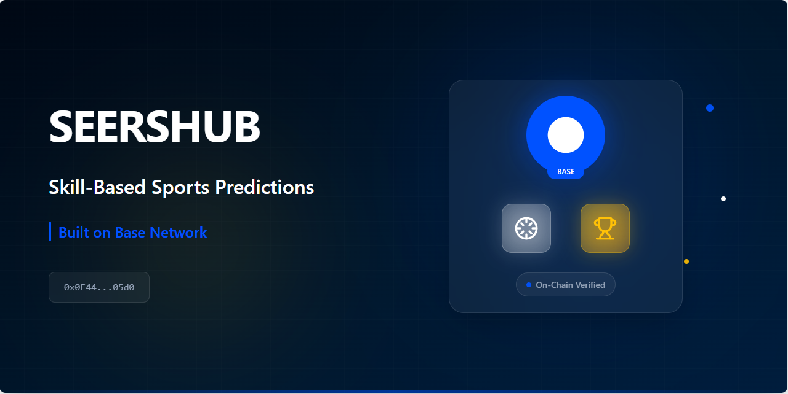

# Seershub



**Skill-based sports prediction competitions on Base Network.**
```markdown
# Seershub

**Skill-based sports prediction competitions on Base Network.**

*Not gambling. Not betting. Pure skill.*

[](https://sepolia.basescan.org/address/0x76267C394BeBA8367C6AB439452988219Aac82c7)
[](https://seershub.com)
[](LICENSE)

---

## 🎯 What We Built

Seershub lets sports fans compete based on prediction accuracy - no gambling mechanics, no odds, no house edge. Just transparent, on-chain skill competition.

**Live on Base Sepolia:**  
Contract: `0x76267C394BeBA8367C6AB439452988219Aac82c7`  
Platform: [seershub.com](https://seershub.com)

---

## 🔵 Why This Matters

Traditional sports prediction platforms are:
- ❌ Opaque (you can't verify results)
- ❌ Centralized (trust the platform)
- ❌ Gambling-based (odds, house edge)

Seershub is:
- ✅ Transparent (every prediction on Base blockchain)
- ✅ Verifiable (anyone can audit on BaseScan)
- ✅ Skill-based (fixed entry fees, community pools)

**Legal in most jurisdictions** - same framework as DraftKings/FanDuel fantasy sports.

---

## 🛠 How It Works

### For Users
1. Connect Coinbase Smart Wallet
2. Browse live football matches
3. Submit predictions (1-5 USDC per match)
4. Compete weekly for prize pools
5. Top 10% winners split the pot

### On-Chain Architecture
```
Predictions → Base Blockchain (immutable)
Results → Oracle verification (Merkle tree)
Scoring → Off-chain calculation (gas efficient)
Rewards → On-chain distribution (Merkle proofs)
```

### Smart Contract
```solidity
contract SeershubPredictions {
    enum Outcome { HOME, DRAW, AWAY }
    
    function submitPrediction(uint256 matchId, Outcome prediction) external;
    function getStats() external view returns (uint256 total, uint256 users);
}
```

Full contract: [View on BaseScan](https://sepolia.basescan.org/address/0x76267C394BeBA8367C6AB439452988219Aac82c7)

---

## 💻 Tech Stack

**Blockchain:**
- Base Network (Ethereum L2)
- Solidity 0.8.20
- Hardhat development

**Frontend:**
- Next.js 14 with App Router
- TypeScript for type safety
- Tailwind CSS for styling
- Framer Motion for animations

**Web3 Integration:**
- Wagmi v2 + Viem
- Coinbase Smart Wallet SDK
- EIP-2612 permit (gasless approvals)

**Why Base?**
- Coinbase's 120M users → easy onboarding
- <$0.01 transaction fees → viable for $1-5 predictions
- Sub-second finality → instant feedback
- Growing ecosystem → network effects

---

## 📊 Current Status

**Testnet Deployment:**
```
Network: Base Sepolia
Contract: 0x76267C394BeBA8367C6AB439452988219Aac82c7
Predictions: 10+ on-chain
Users: Active testing
Status: ✅ Verified on BaseScan
```

**Live Links:**
- Landing: [seershub.com](https://seershub.com)
- Contract: [BaseScan](https://sepolia.basescan.org/address/0x76267C394BeBA8367C6AB439452988219Aac82c7)
- GitHub: You're here!

---

## 🚀 What's Next

### Immediate (This Week)
- [x] Smart contract deployed
- [x] Landing page live
- [ ] Demo app (wallet connect + predictions)
- [ ] Base Builder grant application

### Q2 2026
- [ ] Complete contract suite (Treasury, Oracle, Premium)
- [ ] Security audit
- [ ] Base Mainnet deployment
- [ ] Public beta (500 users)

### Q3 2026
- [ ] Multi-sport expansion (basketball, cricket)
- [ ] Mobile app
- [ ] 10K+ active users
- [ ] BASE token integration

### 2026
- [ ] DAO governance (SEER token)
- [ ] Achievement NFTs on Base
- [ ] Cross-chain expansion

---

## 🏗 For Developers

### Run Locally

```bash
# Clone
git clone https://github.com/seershub/seershub-landing.git
cd seershub-landing

# Install
npm install

# Configure (.env.local)
PRIVATE_KEY=your_test_wallet_key
BASE_SEPOLIA_RPC_URL=https://sepolia.base.org

# Deploy contract
npx hardhat run scripts/deploy.ts --network baseSepolia

# Start frontend
npm run dev
```

### Project Structure

```
seershub-landing/
├── contracts/
│   └── SeershubPredictions.sol    # Prediction logic
├── scripts/
│   ├── deploy.ts                  # Deploy to Base
│   └── test-predictions.ts        # Submit test data
├── app/
│   ├── page.tsx                   # Landing page
│   └── api/                       # Waitlist endpoint
├── components/
│   └── sections/                  # UI components
└── hardhat.config.ts              # Base network config
```

### Test on Sepolia

1. Get testnet ETH: [Base Faucet](https://www.coinbase.com/faucets/base-ethereum-goerli-faucet)
2. Run: `npx hardhat run scripts/test-predictions.ts --network baseSepolia`
3. View on [BaseScan](https://sepolia.basescan.org/address/0x76267C394BeBA8367C6AB439452988219Aac82c7)

---

## 📈 Traction

**Community:**
- Twitter: [@seershub](https://twitter.com/seershub)
- Waitlist: 150+ signups
- Base Discord: Active member

**Technical:**
- Contract verified ✅
- 10+ test predictions ✅
- Gas cost: <$0.01 per tx ✅
- GitHub: Public & documented ✅

---

## 🎯 Target Market

**Primary Users:**
- Sports fans (100M+ globally)
- Fantasy sports players (60M+ in US)
- Crypto-curious sports enthusiasts
- BASE token holders

**Not targeting:**
- Gamblers (we're skill-based)
- Day traders (different use case)
- Degens (we're mainstream-focused)

**Geographic Focus:**
- US, UK, EU (legal as skill competition)
- Turkey (large football fanbase)
- Global expansion (non-gambling framework)

---

## 💡 Business Model

**Revenue Streams:**
1. Protocol fees (15-22% of entry fees)
2. Premium subscriptions ($19.99/month)
3. Sponsored matches (brands add to prize pools)
4. Affiliate program (10% commission)

**Unit Economics:**
- Entry fee: $1-5 USDC per prediction
- Prize pool: 68-75% to winners
- Protocol fee: 15-22% (volume discounts apply)
- Reserve: 10% (capped at $100K)

**Sustainability:**
- Break-even: 15K active users
- Target: 50K users by end of 2025
- No VC dependency (community-funded growth)

---

## 🤝 Contributing

We're open source and welcome contributions:

1. Fork this repo
2. Create branch: `git checkout -b feature/your-idea`
3. Commit: `git commit -m 'Add your idea'`
4. Push: `git push origin feature/your-idea`
5. Open Pull Request

**Good first issues:**
- UI improvements
- Gas optimizations
- Documentation
- Test coverage

---

## 📜 License

MIT License - build on top of this freely.

---

## 🙏 Credits

Built by [@seershub](https://x.com/seershub) team.

**Technology:**
- Base Network for L2 infrastructure
- Coinbase Wallet for user onboarding
- OpenZeppelin for secure contract patterns

**Inspiration:**
- DraftKings/FanDuel (skill-based model)
- Polymarket (on-chain predictions)
- Sorare (Web3 sports engagement)

---

## 📞 Contact

- **Web:** [seershub.com](https://seershub.com)
- **X:** [@seershub](https://x.com/seershub)
- **Email:** (info@seershub.com)
- **Base Discord:** Find us in #builders

---

**Building the future of sports predictions on Base.**

🔵 *Transparent. Fair. Community-owned.*
```

